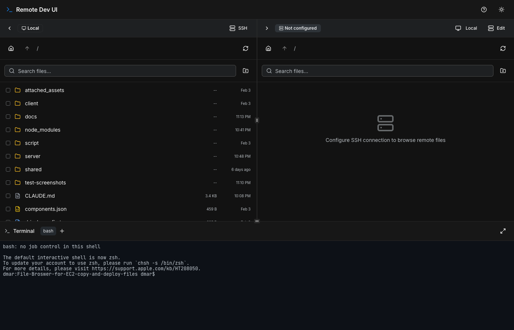
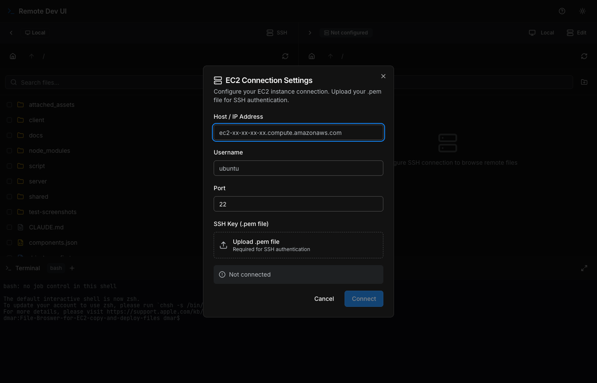
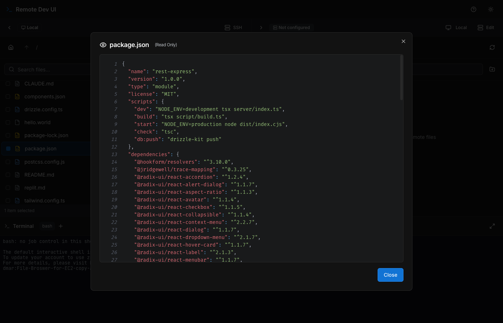
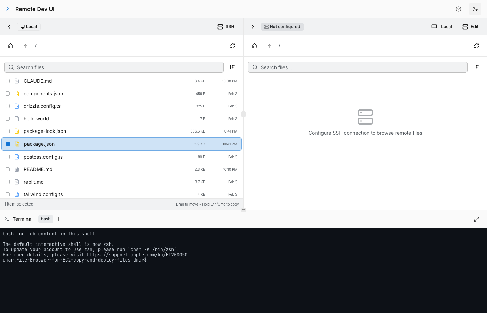

# Remote Dev UI

A web-based dual-pane file browser with an integrated terminal, designed for managing files on local machines and EC2 instances through a browser. Connect to remote servers via SSH/SFTP and transfer files between local and remote filesystems with drag and drop.



## Features

- **Dual-pane file browser** — two independent panels for navigating directories side by side
- **SSH/SFTP remote access** — connect to EC2 instances with .pem key authentication and browse remote filesystems
- **Cross-host file transfer** — drag files between local and remote panels to copy or move across hosts
- **Remote terminal** — SSH shell sessions on connected EC2 instances via the integrated terminal
- **Drag and drop** — move files between panels (drag to move, hold Ctrl/Cmd to copy)
- **Multi-select** — select multiple files for batch operations (copy, move, delete)
- **Integrated terminal** — full xterm.js terminal with multiple sessions, maximizable to full screen
- **File preview** — syntax-highlighted code preview, markdown rendering, and raw text display
- **File operations** — create, rename, delete, upload, and download files and folders (folders download as zip)
- **Dark/light theme** — toggle between themes
- **Resizable panels** — drag to resize the file browser panels and terminal

## Screenshots

### SSH Connection Settings
Configure your EC2 instance with hostname, username, and .pem key file:



### File Preview
View files with syntax highlighting directly in the browser:



### Light Mode
Full light theme support:



## Prerequisites

- Node.js 18+
- npm

## Quick Start

```bash
# Install dependencies
npm install

# Start the dev server
npm run dev
```

Open **http://localhost:5000** in your browser.

## Connecting to an EC2 Instance

1. Click the **SSH** button on either panel's header
2. Click **Edit** to open connection settings
3. Enter your EC2 hostname, username (e.g. `ubuntu`), and port
4. Upload your `.pem` key file
5. Click **Connect**

Once connected, the panel shows the remote filesystem. The integrated terminal automatically opens an SSH shell session to the connected host.

## Production Build

```bash
# Build client and server
npm run build

# Run production server
npm run start
```

The build produces a self-contained `dist/` directory — `dist/public/` for client assets and `dist/index.cjs` for the server.

## Deploy on EC2

```bash
# SSH into your instance
ssh -i your-key.pem ec2-user@your-ec2-ip

# Install Node.js (if needed)
curl -fsSL https://deb.nodesource.com/setup_20.x | sudo -E bash -
sudo apt-get install -y nodejs

# Clone and set up
git clone <repository-url>
cd remote-dev-ui
npm install

# Option A: Run directly
npm run build && npm run start

# Option B: Run with PM2 (recommended)
npm install -g pm2
npm run build
pm2 start npm --name "dev-ui" -- run start
```

Make sure your EC2 security group allows inbound traffic on port 5000.

## Environment Variables

| Variable | Default | Description |
|----------|---------|-------------|
| `PORT` | `5000` | Server port |
| `NODE_ENV` | — | Set to `production` for production builds |

## Tech Stack

**Frontend:** React 18, TypeScript, TailwindCSS, shadcn/ui, TanStack Query, Wouter, xterm.js, Framer Motion

**Backend:** Express 5, ssh2 (SFTP/SSH), WebSocket (ws), Multer, Archiver, esbuild

**Build:** Vite, esbuild, TypeScript

## License

MIT
